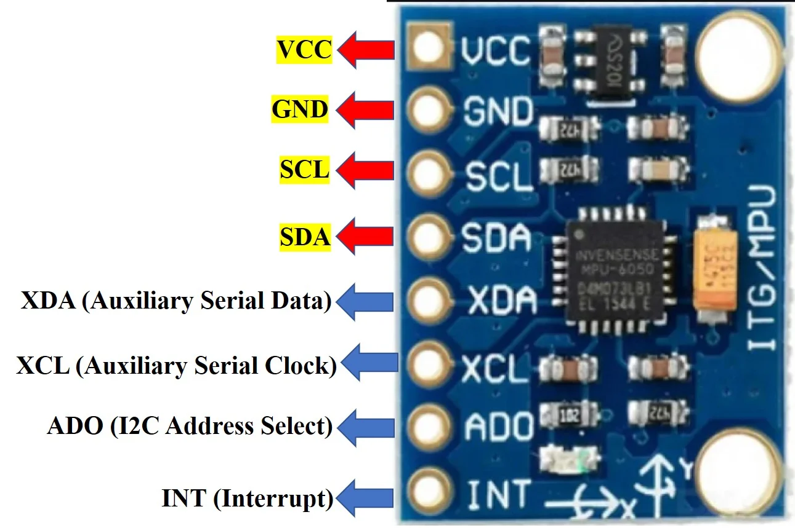

# MPU6050 Tutorial


Welcome to the MPU6050 tutorial! In this guide, you'll learn about the MPU6050 sensor, how it works, and how to use it with an Arduino. Let's get started!

## Table of Contents

1. [Introduction](#introduction)
2. [Theory](#theory)
3. [Connecting the MPU6050](#connecting-the-mpu6050)
4. [Arduino Code](#arduino-code)
5. [Troubleshooting](#troubleshooting)
6. [Tasks](#tasks)

---

## Introduction

The MPU6050 is a sensor that combines a 3-axis gyroscope and a 3-axis accelerometer. It is commonly used in robotics and motion tracking applications.

## Theory

The MPU6050 measures acceleration and rotation along the X, Y, and Z axes. Here's a quick overview:

- **Accelerometer:** Measures the rate of change of velocity (acceleration).
- **Gyroscope:** Measures the rate of rotation around an axis.

By combining data from both sensors, you can get a good understanding of the orientation and movement of the sensor.



## Connecting the MPU6050

Here’s how to connect the MPU6050 to an Arduino:

1. **VCC**: Connect to 3.3V or 5V on the Arduino.
2. **GND**: Connect to Ground (GND) on the Arduino.
3. **SCL**: Connect to A5 on the Arduino.
4. **SDA**: Connect to A4 on the Arduino.


## Arduino Code

Here is a simple example of how to read data from the MPU6050 using Arduino. 

### Step-by-Step Code

1. **Include the Library**: First, include the Wire library and the MPU6050 library.
2. **Initialize the Sensor**: In the setup, initialize communication and the sensor.
3. **Read and Print Data**: In the loop, read the sensor data and print it to the Serial Monitor.

```cpp
#include <Wire.h>
#include <MPU6050.h>

MPU6050 mpu;

void setup() {
  Serial.begin(9600);
  Wire.begin();
  mpu.initialize();

  if (mpu.testConnection()) {
    Serial.println("MPU6050 connection successful");
  } else {
    Serial.println("MPU6050 connection failed");
  }
}

void loop() {
  int16_t ax, ay, az, gx, gy, gz;
  mpu.getMotion6(&ax, &ay, &az, &gx, &gy, &gz);

  Serial.print("a/g:\t");
  Serial.print(ax); Serial.print("\t");
  Serial.print(ay); Serial.print("\t");
  Serial.print(az); Serial.print("\t");
  Serial.print(gx); Serial.print("\t");
  Serial.print(gy); Serial.print("\t");
  Serial.println(gz);

  delay(500);
}
```

## Troubleshooting

Here are some common issues and solutions:

- **No Data on Serial Monitor**: Check the connections and ensure the MPU6050 is properly powered.
- **MPU6050 Connection Failed**: Make sure the SCL and SDA lines are correctly connected. Check for loose wires.
- **Random Values**: Ensure your sensor is still and on a flat surface during testing.

## Tasks

Here are some tasks to help you practice using the MPU6050:

<details>
  <summary>Task 1: Basic Data Reading</summary>

  - Read acceleration and gyroscope data from the MPU6050.
  - Print the data to the Serial Monitor.
  - **Hint**: Use the provided code as a reference.
</details>

<details>
  <summary>Task 2: Calculate Pitch and Roll</summary>

  - Use the accelerometer data to calculate the pitch and roll of the sensor.
  - Print the calculated values to the Serial Monitor.
  - **Hint**: You can use the `atan2` function to calculate angles.
</details>

<details>
  <summary>Task 3: Simple Motion Detection</summary>

  - Detect when the sensor is moved.
  - Turn on an LED when motion is detected.
  - **Hint**: Compare the current and previous acceleration values to detect motion.
</details>

---

### Navigation

- [Home](../index.html)

---


```
