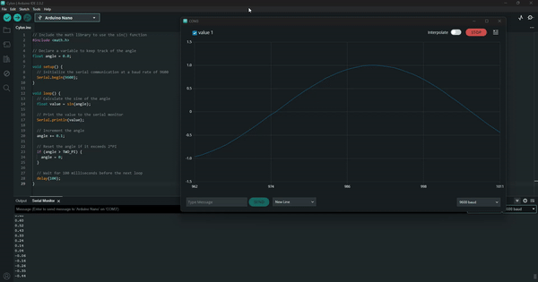

# Serial Plotter

The Arduino Serial Plotter is a tool that allows you to visualize data from your Arduino board in real-time. It can be used to plot sensor data, waveforms, or any other data that changes over time. 


## Example: Plotting a Sine Wave with the Arduino Serial Plotter

A very simple way to try out the Arduino Serial Plotter is to create a sketch that sends some varying data to the serial port. The Serial Plotter can graph this data in real-time. One of the simplest examples is to plot a sine wave. Here’s a basic sketch to do this:




```cpp
// Include the math library to use the sin() function
#include <math.h>

// Declare a variable to keep track of the angle
float angle = 0.0;

void setup() {
  // Initialize the serial communication at a baud rate of 9600
  Serial.begin(9600);
}

void loop() {
  // Calculate the sine of the angle
  float value = sin(angle);

  // Print the value to the serial monitor
  Serial.println(value);

  // Increment the angle
  angle += 0.1;

  // Reset the angle if it exceeds 2*PI
  if (angle > TWO_PI) {
    angle = 0;
  }

  // Wait for 100 milliseconds before the next loop
  delay(100);
}
```

### Explanation:

1. **Include Math Library**:
   - `#include <math.h>` includes the math library to use the `sin()` function.

2. **Variable Declaration**:
   - `float angle = 0.0;` declares a floating-point variable named `angle` and initializes it to 0.0.

3. **Setup Function**:
   - `Serial.begin(9600);` initializes serial communication at a baud rate of 9600 bits per second.

4. **Loop Function**:
   - `float value = sin(angle);` calculates the sine of the current angle.
   - `Serial.println(value);` prints the sine value to the serial monitor.
   - `angle += 0.1;` increments the angle by 0.1 radians.
   - `if (angle > TWO_PI) { angle = 0; }` resets the angle if it exceeds 2π (a full cycle).
   - `delay(100);` waits for 100 milliseconds before the next iteration of the loop.

### Using the Serial Plotter:

1. Upload the sketch to your Arduino board.
2. Open the Serial Plotter by navigating to `Tools > Serial Plotter` in the Arduino IDE.
3. Ensure the baud rate is set to 9600 in the Serial Plotter.
4. You should see a sine wave being plotted in real-time.

This sketch provides a simple way to visualize data using the Serial Plotter. You can modify the angle increment and delay to see how it affects the plotted sine wave.

## Additional Tasks

### 1. Modify the Angle Increment

Write a program that modifies the angle increment to change the frequency of the sine wave plotted on the Serial Plotter.

<details>
<summary>Hint 1</summary>
Identify the line where the angle is incremented.
</details>

<details>
<summary>Hint 2</summary>
Change the increment value to a different number.
</details>

<details>
<summary>Solution</summary>

```cpp
#include <math.h>

float angle = 0.0;

void setup() {
  Serial.begin(9600);
}

void loop() {
  float value = sin(angle);
  Serial.println(value);

  // Change the increment value to modify the frequency
  angle += 0.05; // Smaller increment for a higher frequency wave

  if (angle > TWO_PI) {
    angle = 0;
  }

  delay(100);
}
```

</details>

### 2. Use a Different Mathematical Function

Write a program that plots a different mathematical function, such as a cosine wave, on the Serial Plotter.

<details>
<summary>Hint 1</summary>
Identify the line where the sine function is used.
</details>

<details>
<summary>Hint 2</summary>
Replace the sine function with the cosine function.
</details>

<details>
<summary>Solution</summary>

```cpp
#include <math.h>

float angle = 0.0;

void setup() {
  Serial.begin(9600);
}

void loop() {
  // Use the cosine function instead of the sine function
  float value = cos(angle);
  Serial.println(value);

  angle += 0.1;

  if (angle > TWO_PI) {
    angle = 0;
  }

  delay(100);
}
```

</details>

### 3. Plot Multiple Waves Simultaneously

Write a program that plots both sine and cosine waves simultaneously on the Serial Plotter.

<details>
<summary>Hint 1</summary>
Calculate both sine and cosine values in the loop function.
</details>

<details>
<summary>Hint 2</summary>
Print both values to the Serial Monitor, separated by a space or comma.
</details>

<details>
<summary>Solution</summary>

```cpp
#include <math.h>

float angle = 0.0;

void setup() {
  Serial.begin(9600);
}

void loop() {
  float sineValue = sin(angle);
  float cosineValue = cos(angle);

  // Print both values separated by a comma
  Serial.print(sineValue);
  Serial.print(", ");
  Serial.println(cosineValue);

  angle += 0.1;

  if (angle > TWO_PI) {
    angle = 0;
  }

  delay(100);
}
```

</details>

These tasks will help you explore more features of the Arduino Serial Plotter and understand how to manipulate and visualize data in real-time.