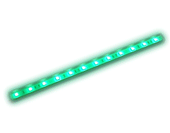

# Controlling a WS2812B LED Strip with Arduino



## Introduction
Transition from using the Arduino's built-in LED to controlling a WS2812B LED strip. This guide will help you set up the LED strip and introduce breadboards for circuit connections. We’ll start with an example sketch from the FastLED library, then move on to creating a sine wave animation.

## Gather Necessary Components
- Arduino Board (e.g., Arduino Nano)
- USB Cable
- WS2812B LED Strip (with GND, DATA, and VOLTAGE cables)
- Connecting Wires
- Breadboard

## Breadboards


### Purpose
Breadboards are used for prototyping electronic circuits without soldering.

### Structure
- Rows and Columns: Grid of holes arranged in rows and columns.
- Metal Strips: Underneath the board, connect the holes electrically.

### Power Rails
- Lines: Two long rows along the top and bottom for power distribution.
- Purpose: Used to connect power supply (positive and negative).

### Terminal Strips
- Rows: Short horizontal rows in the middle.
- Connections: Each row of five holes is electrically connected, allowing components to be inserted and interconnected.

### Component Placement
- Insertion: Components like resistors, capacitors, and ICs are inserted into the holes.
- Connections: Wires or jumper cables connect different components.

### Integration
- Circuits: Allows easy creation and modification of circuits.
- Testing: Facilitates testing and troubleshooting before finalizing designs.

### Advantages
- Non-permanent: Components can be easily removed or replaced.
- Reusable: Breadboards can be reused for multiple projects.

### Common Uses
- Ideal for learning, prototyping, and debugging electronic circuits.

## Circuit Connections

### Power Connections
- Connect the 5V and GND of the power supply to the LED strip using a breadboard.
  - Black Wire (GND): Connect the GND pin of the LED strip to the GND rail on the breadboard.
  - Red Wire (5V): Connect the 5V pin of the LED strip to the 5V rail on the breadboard.
  - Plug the Arduino into your computer via USB. The LEDs should light up.

### Data Connection
- Unplug the Arduino.
- Connect the Data Input (DIN) of the LED strip to analog pin A3 on the Arduino.
  - Data Wire: Connect the DIN pin of the LED strip to analog pin A3 on the Arduino.

### Basic Wiring Diagram


```
Arduino          WS2812B LED Strip
5V  ------------  5V
GND ------------  GND
A3  ------------  DIN
```

### Install Necessary Library
FastLED Library:
- Open Arduino IDE.
- Navigate to `Sketch` > `Include Library` > `Manage Libraries`.
- Search for "FastLED" and install the library.

## RGB LEDs: How They Work
- Red, Green, Blue (RGB):
  - RGB LEDs use three separate LEDs in one package: red, green, and blue.
  - By varying the intensity of each color, you can create a wide spectrum of colors.
  - Combining red and green creates yellow, green and blue create cyan, and red and blue create magenta.
  - Full intensity of all three colors creates white light.

## Example Sketch

```cpp
#include <FastLED.h>

#define LED_PIN A3
#define NUM_LEDS 8
#define BRIGHTNESS 50  // Set brightness level (0-255)

CRGB leds[NUM_LEDS];

void setup() {
  FastLED.addLeds<NEOPIXEL, LED_PIN>(leds, NUM_LEDS);
  FastLED.setBrightness(BRIGHTNESS); // Set the brightness for the entire strip
}

void loop() {
  // Set the first LED to barely glow with very dim light
  leds[0] = CRGB(10, 10, 10); // Extremely dim white light to show RGB components
  
  // Set the remaining LEDs to showcase color mixing with dimmed colors
  leds[1] = CRGB(50, 0, 0);   // Dim Red
  leds[2] = CRGB(0, 50, 0);   // Dim Green
  leds[3] = CRGB(0, 0, 50);   // Dim Blue
  leds[4] = CRGB(50, 50, 0);  // Dim Yellow (Red + Green)
  leds[5] = CRGB(0, 50, 50);  // Dim Cyan (Green + Blue)
  leds[6] = CRGB(50, 0, 50);  // Dim Magenta (Red + Blue)
  leds[7] = CRGB(60, 60, 60); // Dim White (Red + Green + Blue)

  // Show the updated LED colors
  FastLED.show();

  // Wait before repeating the loop
  delay(1000);
}
```

### Code Explanation
- **Setup Function:**
  - `FastLED.addLeds<NEOPIXEL, LED_PIN>(leds, NUM_LEDS);`: Initializes the LED strip.
  - `FastLED.setBrightness(BRIGHTNESS);`: Sets the overall brightness of the LED strip.

- **Loop Function:**
  - `leds[0] = CRGB(10, 10, 10);`: Sets the first LED to a very dim white.
  - Sets the remaining LEDs to different colors (dimmed) to showcase RGB mixing.
  - `FastLED.show();`: Updates the LED strip to show the new colors.
  - `delay(1000);`: Waits for 1 second before repeating the loop.

## Transition to More Complicated Example Codes
Now that you understand the basics of controlling an LED strip and color mixing, you can experiment with more complex animations and patterns. Try modifying the example sketches provided by the FastLED library, or create your own patterns and effects. Explore advanced features such as color palettes, sine wave animations, and more.

## Example Sketch
Open Example:
- Go to `File` > `Examples` > `FastLED` > `DemoReel100`.


### Modify the Example
- Change the number of LEDs and the type of LED strip in the example code.
```cpp
#define LED_PIN     A3
#define NUM_LEDS    8
#define LED_TYPE    WS2812
#define COLOR_ORDER GRB
CRGB leds[NUM_LEDS];

void setup() {
  FastLED.addLeds<LED_TYPE, LED_PIN, COLOR_ORDER>(leds, NUM_LEDS).setCorrection(TypicalLEDStrip);
}

void loop() {
  // Existing code for animations
}
```
Upload to Arduino:
- Click the `Upload` button to upload the modified example code to the Arduino.

### Observe the LED Strip
- The LED strip will display various pre-programmed patterns, demonstrating the capabilities of the FastLED library.

### Experiment with Other Animations
- Try modifying the example sketch or creating new sketches to see how different animations affect the LED strip. Some simple ideas include changing colors, speed, or creating new patterns.

## Adapt an Example Code
Simple Adaptation:
- Open the `ColorPalette` example from the FastLED library.
- Modify the colors in the color palette to create a custom sequence.
- Upload the modified code to the Arduino to see the changes in the LED strip.

### Code Example
```cpp
#include <FastLED.h>

#define LED_PIN A3
#define NUM_LEDS 8

CRGB leds[NUM_LEDS];

void setup() {
  FastLED.addLeds<NEOPIXEL, LED_PIN>(leds, NUM_LEDS);
}

void loop() {
  fill_solid(leds, NUM_LEDS, CRGB::Red);
  FastLED.show();
  delay(500);
  fill_solid(leds, NUM_LEDS, CRGB::Green);
  FastLED.show();
  delay(500);
  fill_solid(leds, NUM_LEDS, CRGB::Blue);
  FastLED.show();
  delay(500);
}
```

## Create a Sine Wave Animation
Use a Sine Wave:
- Create a function to generate a sine wave pattern across the 8 LEDs.

### Code Example
```cpp
#include <FastLED.h>
#include <math.h>

#define LED_PIN A3
#define NUM_LEDS 8

CRGB leds[NUM_LEDS];
float angle = 0.0;

void setup() {
  FastLED.addLeds<NEOPIXEL, LED_PIN>(leds, NUM_LEDS);
  FastLED.clear();
  FastLED.show(); // Initialize all pixels to 'off'
}

void loop() {
  for (int i = 0; i < NUM_LEDS; i++) {
    int brightness = (sin(angle + (i * PI / 4)) + 1) * 127.5; // Scale sine wave result to 0-255
    leds[i] = CHSV(0, 0, brightness);
  }

  angle += 0.1;

  if (angle > TWO_PI) {
    angle = 0;
  }

  FastLED.show();

  delay(100);
}
```

With these steps, you should be able to control the WS2812B LED strip using an Arduino, experiment with various animations, and even create a sine wave pattern. Happy coding!