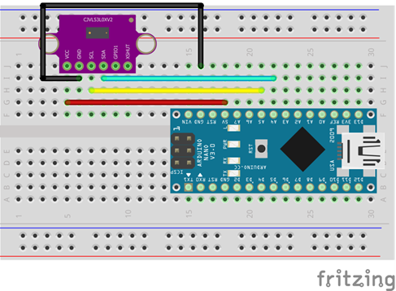

# VL53L0X Distance Sensor Tutorial


The VL53L0X is a Time-of-Flight (ToF) distance sensor capable of measuring distances up to 2 meters with high accuracy. This tutorial will guide you through the basics of setting up and using the VL53L0X sensor with an Arduino.
## Theory of Operation


The sensor includes a voltage regulator and level shifter, making it compatible with both 3.3V and 5V systems. We will use the 3.3 Volt mode for this tutorial.

## Requirements

- VL53L0X Sensor
- Arduino Nano
- Breadboard and jumper wires
- Arduino IDE installed on your computer
- VL53L0X Arduino library

## Setup

### Wiring the Sensor to Arduino

- **GND** (Ground) -> Connect to Arduino GND
- **VCC** (Power) -> Connect to Arduino 3.3V 
- **SCL** (Clock) -> Connect to Arduino A5 (SCL pin)
- **SDA** (Data) -> Connect to Arduino A4 (SDA pin)




### Installing the VL53L0X Library

1. Open the Arduino IDE.
2. Go to **Sketch** > **Include Library** > **Manage Libraries**.
3. In the Library Manager, search for "VL53L0X".
4. Find the "VL53L0X by Pololu" library and click **Install**.

## Basic Code Example

```cpp
/* This example shows how to use continuous mode to take
range measurements with the VL53L0X. It is based on
vl53l0x_ContinuousRanging_Example.c from the VL53L0X API.

The range readings are in units of mm. */

#include <Wire.h>
#include <VL53L0X.h>

VL53L0X sensor;

void setup()
{
  Serial.begin(9600);
  Wire.begin();

  sensor.setTimeout(500);
  if (!sensor.init())
  {
    Serial.println("Failed to detect and initialize sensor!");
    while (1) {}
  }

  // Start continuous back-to-back mode (take readings as
  // fast as possible).  To use continuous timed mode
  // instead, provide a desired inter-measurement period in
  // ms (e.g. sensor.startContinuous(100)).
  sensor.startContinuous();
}

void loop()
{
  Serial.print(sensor.readRangeContinuousMillimeters());
  if (sensor.timeoutOccurred()) { Serial.print(" TIMEOUT"); }

  Serial.println();
}
```

### Code Explanation

- **Libraries**: Includes the Wire library for I2C communication and the VL53L0X library for sensor functions.
- **Sensor Initialization**: Sets up serial communication, initializes the I2C communication, and the sensor itself.
- **Continuous Measurement**: Starts continuous distance measurement in the `setup` function.
- **Reading Distance**: In the `loop` function, reads the distance and prints it to the Serial Monitor.

## Running the Code

1. Connect your Arduino to your computer via USB.
2. Open the Arduino IDE and paste the code above.
3. Select the correct board and port under **Tools**.
4. Upload the code to your Arduino.
5. Open the Serial Monitor (**Tools** > **Serial Monitor**) and set the baud rate to 9600.
6. You should see the distance measurements displayed.

## Tips

- Ensure your wiring is secure to avoid intermittent connections.
- Place the sensor on a stable surface to get accurate readings.


## Troubleshooting

- **Sensor Not Detected**: Check the wiring, ensure the correct voltage is supplied.
- **Incorrect Readings**: Make sure the sensor is not obstructed and is placed perpendicular to the surface you are measuring.
- **Timeouts**: Increase the timeout duration if you experience frequent timeouts.

## Additional Resources

- [VL53L0X Datasheet](https://www.st.com/resource/en/datasheet/vl53l0x.pdf)
- [Arduino VL53L0X Library Documentation](https://www.pololu.com/docs/0J77)

This simple tutorial should get you started with using the VL53L0X sensor. Experiment with different setups and distances to fully explore its capabilities. Happy measuring!


### Task: Blink the LED if Object is Closer Than 10 cm

Modify the basic example code to blink the built-in LED if the sensor detects an object closer than 10 cm.

<details>
<summary>Hint 1</summary>
Add the necessary pin setup for the LED in the `setup` function.
</details>

<details>
<summary>Hint 2</summary>
Check the distance measurement and compare it to the 10 cm threshold.
</details>

<details>
<summary>Hint 3</summary>
Use a simple condition to control the LED state based on the distance measurement.
</details>

<details>
<summary>Solution</summary>

```cpp
#include <Wire.h>
#include <VL53L0X.h>

VL53L0X sensor;

void setup() {
  Serial.begin(9600);
  Wire.begin();
  
  pinMode(LED_BUILTIN, OUTPUT); // Set the built-in LED pin as output

  sensor.setTimeout(500);
  if (!sensor.init()) {
    Serial.println("Failed to detect and initialize sensor!");
    while (1) {}
  }

  sensor.startContinuous();
}

void loop() {
  int distance = sensor.readRangeContinuousMillimeters();
  Serial.print(distance);
  if (sensor.timeoutOccurred()) { 
    Serial.print(" TIMEOUT"); 
  }
  Serial.println();

  if (distance < 100) { // Check if the distance is less than 100 mm (10 cm)
    digitalWrite(LED_BUILTIN, HIGH); // Turn on the LED
  } else {
    digitalWrite(LED_BUILTIN, LOW); // Turn off the LED
  }
}
```

</details>

### Explanation:

1. **LED Setup**: `pinMode(LED_BUILTIN, OUTPUT);` sets the built-in LED pin as an output.
2. **Distance Measurement**: The `loop` function reads the distance from the sensor and prints it to the Serial Monitor.
3. **LED Control**: The `if` statement checks if the distance is less than 100 mm (10 cm). If true, it turns on the LED; otherwise, it turns it off.

This task demonstrates how to combine sensor input with LED control, creating a simple yet practical application of the VL53L0X sensor with an Arduino.


### Task: Indicate Distance with LED Strip

Modify the code to use an LED strip to indicate the distance of an object from the VL53L0X sensor. The number of LEDs lit will increase as the object gets closer to the sensor.

#### Setup

1. **Hardware Requirements**:
   - VL53L0X Distance Sensor
   - Arduino Nano
   - Neopixel (WS2812) LED Strip
   - Breadboard and jumper wires

2. **Wiring**:
   - **VL53L0X Sensor**:
     - **GND** (Ground) -> Connect to Arduino GND
     - **VCC** (Power) -> Connect to Arduino 3.3V 
     - **SCL** (Clock) -> Connect to Arduino A5 (SCL pin)
     - **SDA** (Data) -> Connect to Arduino A4 (SDA pin)
   - **Neopixel LED Strip**:
     - **GND** (Ground) -> Connect to Arduino GND
     - **VCC** (Power) -> Connect to Arduino 5V (or a suitable power supply)
     - **DIN** (Data In) -> Connect to Arduino digital pin 6 (or any other digital pin)

3. **Library Installation**:
   - Install the VL53L0X library by Pololu.
   - Install the Adafruit NeoPixel library.

#### Code

```cpp
#include <Wire.h>
#include <VL53L0X.h>
#include <Adafruit_NeoPixel.h>

#define LED_PIN     6
#define NUM_LEDS    10 // Adjust the number of LEDs in your strip

VL53L0X sensor;
Adafruit_NeoPixel strip = Adafruit_NeoPixel(NUM_LEDS, LED_PIN, NEO_GRB + NEO_KHZ800);

void setup() {
  Serial.begin(9600);
  Wire.begin();
  
  strip.begin();
  strip.show(); // Initialize all pixels to 'off'
  
  sensor.setTimeout(500);
  if (!sensor.init()) {
    Serial.println("Failed to detect and initialize sensor!");
    while (1) {}
  }

  sensor.startContinuous();
}

void loop() {
  int distance = sensor.readRangeContinuousMillimeters();
  Serial.print(distance);
  if (sensor.timeoutOccurred()) { 
    Serial.print(" TIMEOUT"); 
  }
  Serial.println();

  updateLEDS(distance);
}

void updateLEDS(int distance) {
  int numLEDsToLight = map(distance, 0, 2000, 0, NUM_LEDS); // Map distance to number of LEDs
  numLEDsToLight = constrain(numLEDsToLight, 0, NUM_LEDS);

  for (int i = 0; i < NUM_LEDS; i++) {
    if (i < numLEDsToLight) {
      strip.setPixelColor(i, strip.Color(255, 0, 0)); // Red color for LEDs
    } else {
      strip.setPixelColor(i, strip.Color(0, 0, 0)); // Turn off remaining LEDs
    }
  }
  strip.show();
}
```

#### Explanation

1. **Library Inclusions**: Includes the VL53L0X library for the distance sensor and the Adafruit NeoPixel library for controlling the LED strip.
2. **LED Strip Setup**: Defines the pin and number of LEDs in the strip, initializes the strip, and sets all pixels to off.
3. **Distance Measurement**: Reads the distance from the sensor and prints it to the Serial Monitor.
4. **LED Control**: The `updateLEDS` function maps the distance to the number of LEDs to light up. The closer the object, the more LEDs will light up.

### Running the Code

1. Connect your Arduino to your computer via USB.
2. Open the Arduino IDE and paste the code above.
3. Select the correct board and port under **Tools**.
4. Upload the code to your Arduino.
5. Place the sensor and observe the LED strip lighting up based on the distance measured.

This task allows you to visually indicate the distance measured by the VL53L0X sensor using an LED strip, providing a clear and interactive way to understand the sensor's readings.