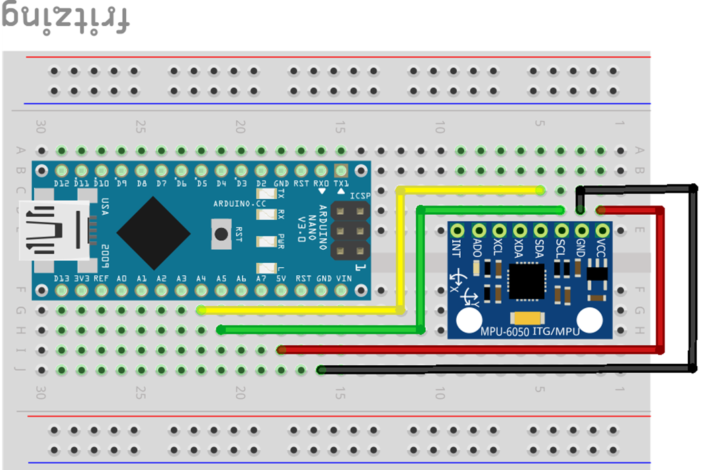
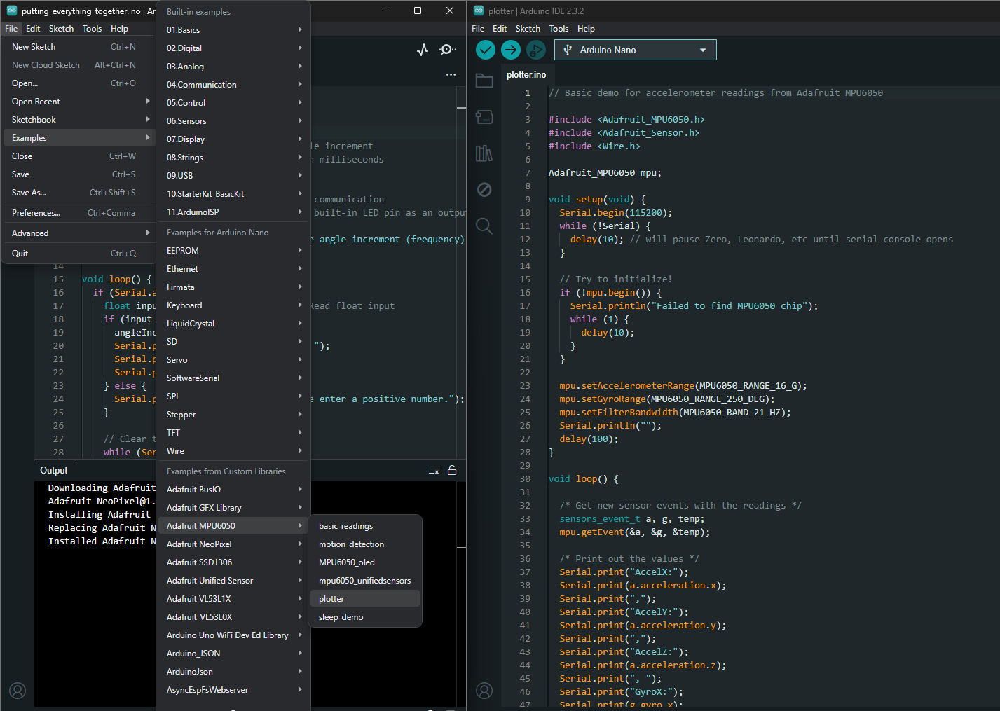

# MPU6050 Sensor Tutorial for Arduino Nano


The MPU6050 is a 6-axis motion tracking device that combines a 3-axis gyroscope and a 3-axis accelerometer, in addition to measuring temperature. This tutorial will guide you through the basics of setting up and using the MPU6050 sensor with an Arduino Nano.

## Components

- MPU6050 Sensor
- Arduino Nano
- Breadboard and jumper wires
- Arduino IDE installed on your computer
- MPU6050 Arduino library

## Setup

### Wiring the Sensor to Arduino Nano


1. **VCC** (Power) -> Connect to Arduino Nano 3.3V or 5V (Check sensor specifications for exact voltage).
2. **GND** (Ground) -> Connect to Arduino Nano GND.
3. **SCL** (Clock) -> Connect to Arduino Nano A5 (SCL pin).
4. **SDA** (Data) -> Connect to Arduino Nano A4 (SDA pin).



### Installing the MPU6050 Library

1. Open the Arduino IDE.
2. Connect your Arduino Nano to your computer via USB.
3. Go to **Sketch** > **Include Library** > **Manage Libraries**.
4. In the Library Manager, search for "MPU6050".
5. Find the "Adafruit MPU6050" library and click **Install**.

### Getting Example Code from the Library

1. In the Arduino IDE, go to **File** > **Examples** > **Adafruit MPU6050** > **plotter**. This will load an example sketch that demonstrates the use of the MPU6050 sensor or use code from below.



2. Review the example code to understand the various functionalities and operations available.

## Basic Code Example -> plotter

If you prefer to start with a simpler example, use the following code:

```cpp
// Basic demo for accelerometer readings from Adafruit MPU6050

#include <Adafruit_MPU6050.h>
#include <Adafruit_Sensor.h>
#include <Wire.h>

Adafruit_MPU6050 mpu;

void setup(void) {
  Serial.begin(115200);
  while (!Serial) {
    delay(10); // will pause Zero, Leonardo, etc until serial console opens
  }

  // Try to initialize!
  if (!mpu.begin()) {
    Serial.println("Failed to find MPU6050 chip");
    while (1) {
      delay(10);
    }
  }

  mpu.setAccelerometerRange(MPU6050_RANGE_16_G);
  mpu.setGyroRange(MPU6050_RANGE_250_DEG);
  mpu.setFilterBandwidth(MPU6050_BAND_21_HZ);
  Serial.println("");
  delay(100);
}

void loop() {

  /* Get new sensor events with the readings */
  sensors_event_t a, g, temp;
  mpu.getEvent(&a, &g, &temp);

  /* Print out the values */
  Serial.print("AccelX:");
  Serial.print(a.acceleration.x);
  Serial.print(",");
  Serial.print("AccelY:");
  Serial.print(a.acceleration.y);
  Serial.print(",");
  Serial.print("AccelZ:");
  Serial.print(a.acceleration.z);
  Serial.print(", ");
  Serial.print("GyroX:");
  Serial.print(g.gyro.x);
  Serial.print(",");
  Serial.print("GyroY:");
  Serial.print(g.gyro.y);
  Serial.print(",");
  Serial.print("GyroZ:");
  Serial.print(g.gyro.z);
  Serial.println("");

  delay(10);
}
```

### Code Explanation

- **Libraries**: Includes the Wire library for I2C communication and the MPU6050 library for sensor functions.
- **Sensor Initialization**: Sets up serial communication, initializes the I2C communication, and the sensor itself.
- **Reading Data**: In the `loop` function, reads acceleration and gyroscope data and prints it to the Serial Monitor.

## Running the Code

1. Connect your Arduino Nano to your computer via USB.
2. Open the Arduino IDE and paste the basic code example above.
3. Select the correct board (Arduino Nano) and port under **Tools**.
4. Upload the code to your Arduino Nano.
5. Open the Serial Monitor (**Tools** > **Serial Monitor**) and set the baud rate to 9600.
6. You should see the acceleration and gyroscope readings displayed.

## Tips

- Ensure your wiring is secure to avoid intermittent connections.
- Place the sensor on a stable surface to get accurate readings.
- Calibrate the sensor if you notice significant drift in the readings.

## Troubleshooting

- **Sensor Not Detected**: Check the wiring, ensure the correct voltage is supplied.
- **Incorrect Readings**: Make sure the sensor is not subjected to excessive vibrations or movements during initialization.
- **No Output**: Verify the baud rate of the Serial Monitor matches the one set in the code.

## Additional Resources

- [MPU6050 Datasheet](https://invensense.tdk.com/wp-content/uploads/2015/02/MPU-6000-Datasheet1.pdf)
- [Arduino MPU6050 Library Documentation](https://github.com/jrowberg/i2cdevlib/tree/master/Arduino/MPU6050)

This simple tutorial should get you started with using the MPU6050 sensor with your Arduino Nano. Experiment with different setups and movements to fully explore its capabilities. Happy experimenting!