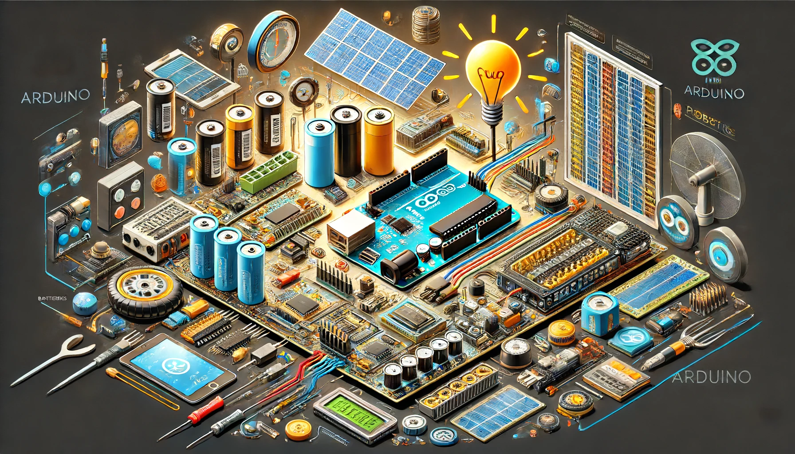

### Power in Robotics

- **Power**: The rate at which energy is used or produced. Measured in watts (W).
- **Energy**: The capacity to do work. Measured in joules (J) or watt-hours (Wh).

### Batteries
- **Battery**: A device consisting of one or more electrochemical cells that convert stored chemical energy into electrical energy.
- **Capacity**: The total amount of energy a battery can store, typically measured in ampere-hours (Ah) or milliampere-hours (mAh).
- **Voltage (V)**: The electrical potential difference between two points. Common battery voltages in robotics include 3.7V, 7.4V, and 12V.
- **Current (I)**: The flow of electric charge, measured in amperes (A). Determines how fast energy is delivered from the battery.
- **Discharge Rate**: The rate at which a battery can safely be discharged, often denoted as a multiple of its capacity (C-rate).

### Ground
- **Ground**: A common reference point in an electrical circuit. Used as a return path for electrical current. In robotics, it ensures safety and stability in the circuit.
- **Common Ground**: Ensuring all parts of the system have the same ground reference to prevent voltage differences that could cause malfunction or damage.

### Volts
- **Voltage**: The electric potential difference. Determines how much potential energy is available to push electrons through a circuit.
- **Nominal Voltage**: The typical operating voltage of a battery or power supply.
- **Voltage Drop**: The reduction in voltage as current moves through a circuit, caused by resistance.

### Basic Concepts
- **Ohm’s Law**: V = I × R, where V is voltage, I is current, and R is resistance. Fundamental for understanding how voltage, current, and resistance interact.
- **Watt’s Law**: P = V × I, where P is power, V is voltage, and I is current. Used to calculate the power usage in circuits.
- **Resistance (R)**: The opposition to the flow of current, measured in ohms (Ω).
- **Circuit**: A complete path for electricity to flow from a power source, through a load, and back to the ground.
- **Load**: Any component or device in the circuit that consumes power, such as motors, sensors, or LEDs.

These terms and concepts are fundamental for understanding and working with power systems in robotics.